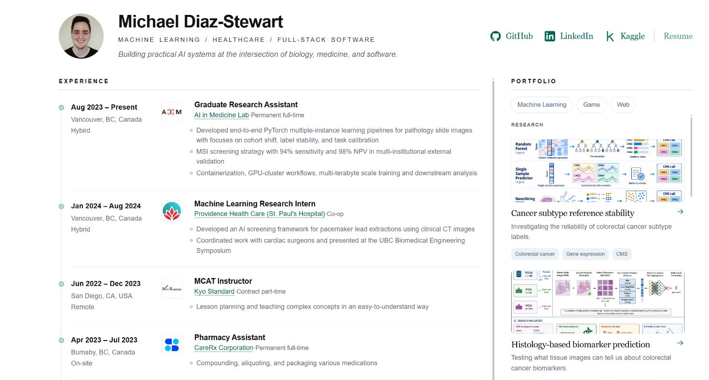

# My Portfolio Website



Hello! I built this with **Codex.** The framework is **Svelte 5, SvelteKit 3, and TypeScript**, with fully static output for GitHub Pages.

## Fork and run locally, feel free to make it your own

Use Node.js **22.17 or newer**; Node 24 is specified in `.nvmrc`.

Clone or download this repository, open a terminal in its folder, then run:

```sh
npm ci
npm run dev
```

Open the local URL printed in your terminal.

```sh
npm run check    # Svelte and TypeScript diagnostics
npm run build    # Generate the static site in build/
npm run preview  # Preview the production build
```
Content and presentation live in these files:

| File | What to change |
| --- | --- |
| `src/lib/data/profile.ts` | Name, tagline, profile links, portrait, experience, education, awards, publications, and posters |
| `src/lib/data/projects.ts` | Project order, slugs, summaries, images, descriptions, topics, resource links |
| `src/app.css` | Colours, typography, spacing, and responsive layout |
| `static/` | Images, favicon, and an optional résumé PDF |

## Deploying to GitHub Pages

The included [GitHub Actions workflow](.github/workflows/deploy.yml) checks the project, builds it, and deploys the `build/` directory.

1. Push the project and its lockfile to a GitHub repository with a `main` branch.
2. In **Settings → Pages → Build and deployment**, select **GitHub Actions** as the source.
3. Open **Actions → Deploy to GitHub Pages → Run workflow**, or push another commit to `main`.
4. Open the URL shown by the deployment when it finishes.

The workflow reads the base path from GitHub Pages. A project repository works at `https://your-username.github.io/your-repository/`; a `your-username.github.io` repository or configured custom domain works at the root. No repository name is hardcoded in the app.

If your default branch has another name, update the workflow's `on.push.branches` value. Configure a custom domain in the repository's Pages settings before rebuilding.
